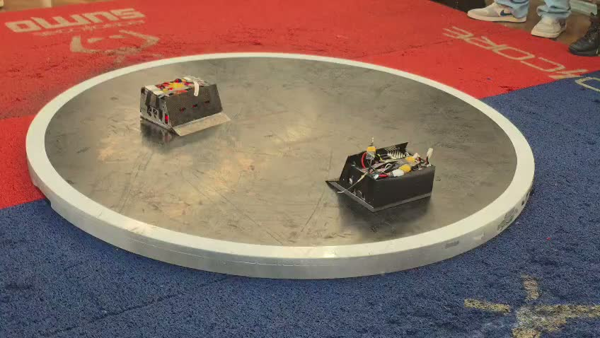
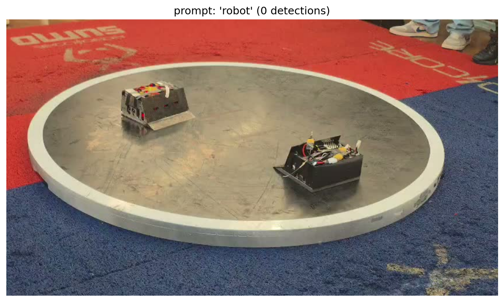
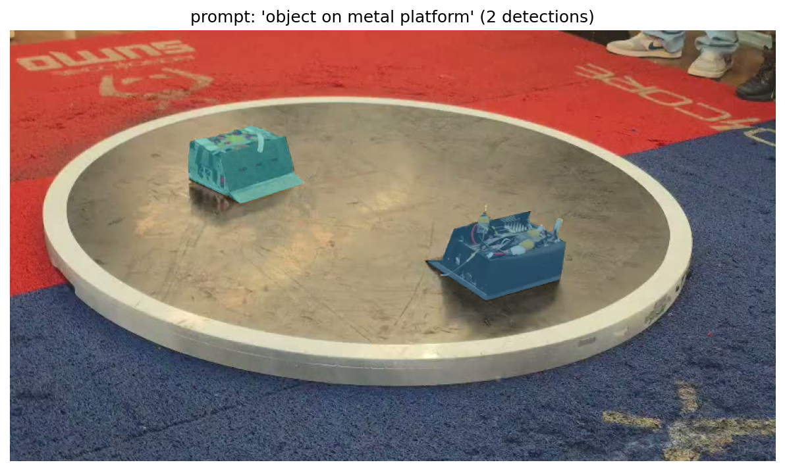
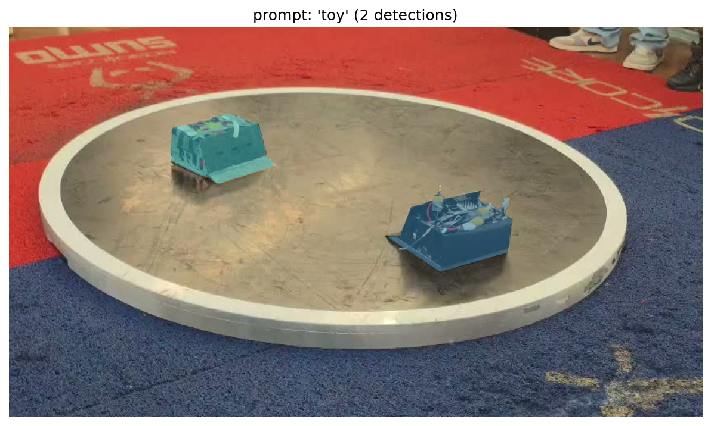
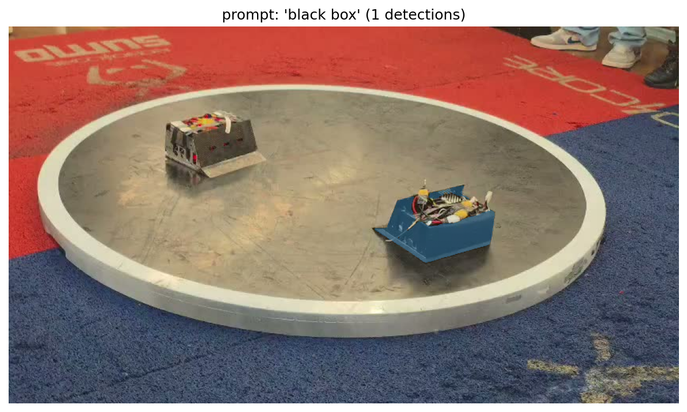

# Teste de Prompts

## O problema

SAM 3 aceita prompt por texto, mas que texto usar? "Robot" parece óbvio, mas robôs de sumô não parecem "robôs" no sentido clássico. São caixas pretas em cima de uma plataforma metálica.

## Input

Primeiro frame do vídeo de teste (Atena vs Bull Bassauro, 848x478, 60fps):

## Metodologia

Testei 10 prompts diferentes usando o image model do SAM 3 (`build_sam3_image_model`). Pra cada prompt, o modelo retorna: máscaras de segmentação, bounding boxes e scores de confiança.

Script: `experiments/sam3-poc/test_prompts.py`

## Resultados

| Prompt | Detecções | Observação |
|--------|-----------|------------|
| `robot` | 0 | Nada detectado |
| `sumo robot` | 0 | Nada detectado |
| `black box` | ? | Detecções parciais |
| `machine` | ? | Detecções parciais |
| `electronic device` | ? | Detecções parciais |
| `object on metal platform` | 2 | Ambos os robôs detectados |
| `small box on circular platform` | ? | Detecções parciais |
| `dark object` | ? | Muitos falsos positivos |
| `vehicle` | ? | Detecções parciais |
| `toy` | 2 | Ambos os robôs detectados |

### Prompt "robot" (0 detecções)

Zero. O modelo não reconhece esses objetos como "robôs". Faz sentido: robôs de sumô são caixas pretas de fibra de carbono, bem diferente da representação visual típica de robôs.

### Prompt "object on metal platform" (2 detecções)

Melhor resultado. Detectou ambos os robôs com máscaras limpas. O prompt descreve o que o modelo realmente vê: objetos em cima de uma plataforma metálica.

### Prompt "toy" (2 detecções)

Também detectou ambos, com qualidade similar. Prompt mais curto e genérico, pode gerar mais falsos positivos em vídeos com plateia visível.

### Prompt "black box"

Detectou parcialmente, mas não tão limpo quanto os dois anteriores.

## Conclusão

**Prompt escolhido:** `"object on metal platform"`

A lição: o prompt precisa descrever o que o modelo vê visualmente, não o que o objeto é semanticamente. O modelo nunca viu "robôs de sumô" no treino, mas sabe identificar "objetos em uma plataforma metálica".
