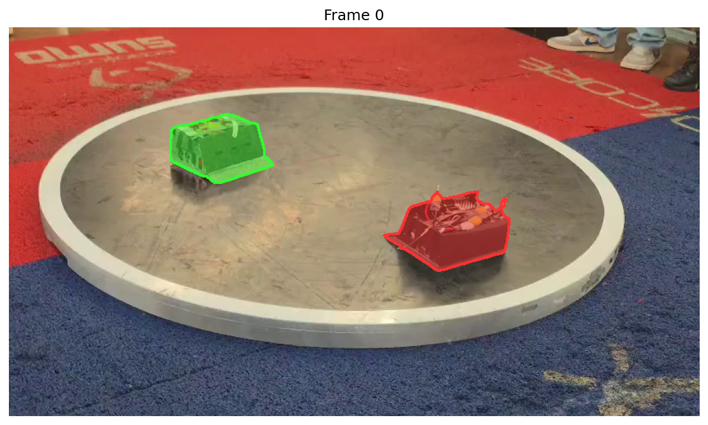
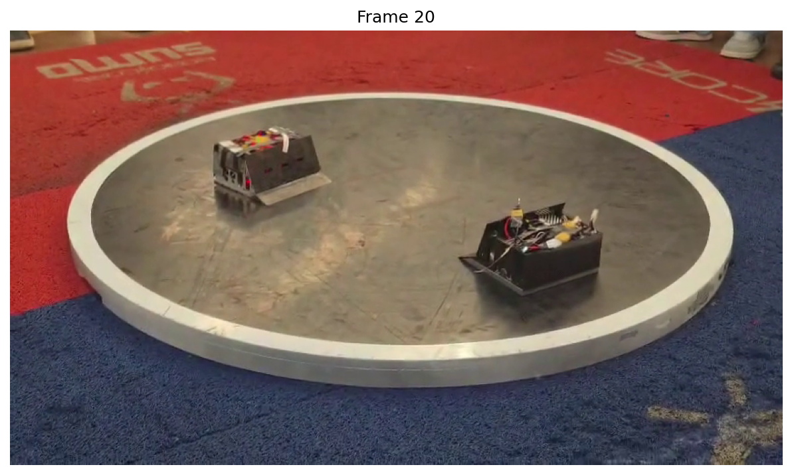
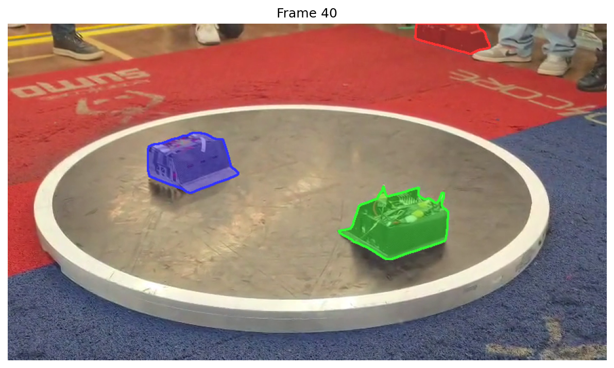
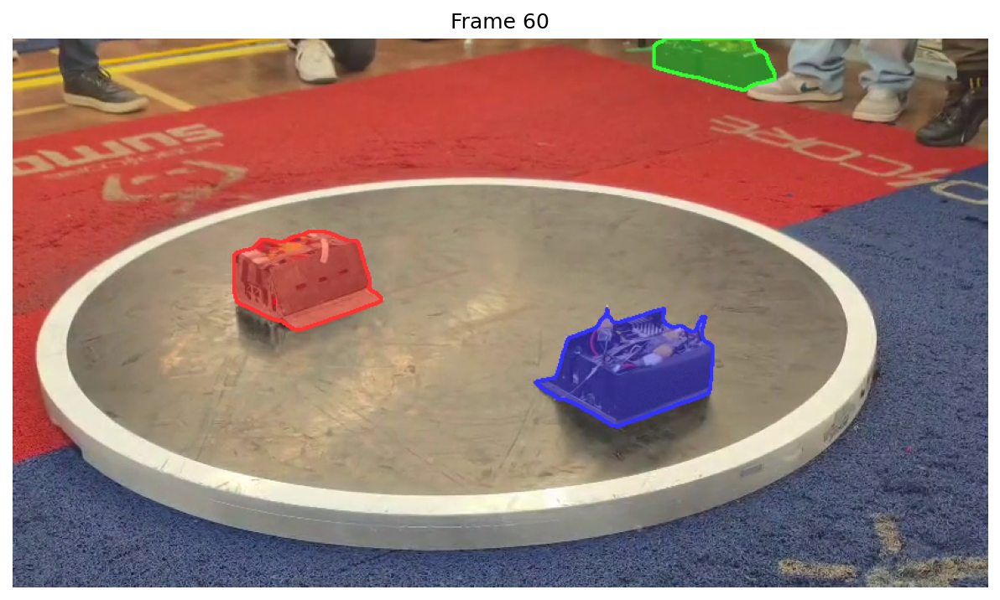

# Video Tracking e VRAM

## O desafio

SAM 3 tem dois modos de operação:

1. **Image model:** processa um frame por vez. Independente entre frames.
2. **Video predictor:** carrega TODOS os frames na GPU de uma vez, faz detecção em um frame e propaga pra todo o vídeo com tracking temporal.

O video predictor é o que a gente quer (tracking mantém identidade dos robôs entre frames). O problema: ele carrega tudo na VRAM.

## O vídeo de teste

- Atena vs Bull Bassauro
- 848x478, 60fps, 10 segundos
- 598 frames no total

## Tentativa 1: vídeo original (60fps)

```
598 frames × feature maps fixos por frame → ~6.8GB só pra frames
Modelo SAM 3 → ~3.6GB
Total: ~10.4GB > 7.63GB disponíveis
```

OOM imediato.

## Tentativa 2: 24fps

```
ffmpeg -vf "fps=24" → 240 frames
Estimativa: ~6.3GB total
```

OOM. A estimativa linear era otimista.

## Tentativa 3: 10fps

```
ffmpeg -vf "fps=10" → 100 frames
```

OOM sem `expandable_segments`. Com a flag, também não rodou (resolução original).

## Tentativa 4: 5fps (primeira que funcionou)

```
ffmpeg -vf "fps=5" → 50 frames
```

Rodou. Resultado:


Dois robôs detectados e trackados. Mas com uma detecção extra no canto superior direito: são robôs reais que estão esperando na lateral, fora do dohyo. O modelo acertou (são objetos na plataforma), mas pra análise da partida a gente só quer os dois que estão lutando.


O tracking temporal funcionou: os robôs mantêm suas cores (identidades) entre frames.

## Tentativa 5: image model frame a frame (10fps)

Pra ter mais FPS, tentei o image model processando cada frame independente:






**Problema:** sem tracking temporal, a identidade dos robôs muda entre frames. O robô que era vermelho vira verde, as cores ficam trocando. Pra análise de partida, isso é inutilizável.

## Tentativa 6: 10fps com resolução reduzida (480x270)

A ideia: metade da resolução = 1/4 dos pixels = menos VRAM por frame.

```
ffmpeg -vf "fps=10,scale=480:270" → 100 frames
```

Com `PYTORCH_CUDA_ALLOC_CONF=expandable_segments:True`: rodou.

### O que é expandable_segments?

O alocador padrão do PyTorch pede blocos grandes de VRAM e subdivide internamente. Quando partes são liberadas, ficam "buracos" (fragmentação). Com `expandable_segments`, os blocos crescem e encolhem dinamicamente, aproveitando melhor a memória livre. Na prática, ganhou os ~30MB que faltavam.

## Tentativas de subir o FPS

| Config | Frames | Resultado |
|--------|--------|-----------|
| 15fps 480p | 151 | OOM |
| 12fps 480p | 120 | OOM |
| 20fps 480p | 201 | OOM |
| 15fps 320p | 151 | OOM |
| 10fps 848p | 100 | OOM |
| 10fps 480p | 100 | Funciona |
| 5fps 848p | 50 | Funciona |

## Descoberta: o gargalo são os feature maps, não os pixels

Reduzir resolução não ajudou proporcionalmente. Isso porque o encoder do SAM 3 gera feature maps de tamanho fixo pra cada frame, independente da resolução de entrada. A resolução afeta o armazenamento dos pixels brutos (~330MB de diferença entre 848p e 480p pra 100 frames), mas o custo dominante são os feature maps.

**O limite real: ~100 frames na RTX 4070 8GB.** Pra um vídeo de 10s, isso dá 10fps.

## Tentativa com ROI (crop no dohyo)

Tentei detectar automaticamente o dohyo (via threshold no branco da tawara) e cropar o vídeo antes de alimentar o SAM 3. A detecção funcionou:


Mas o crop não resolveu o OOM porque os feature maps são tamanho fixo por frame. O crop ajuda em eliminar falsos positivos (sem fundo = sem sapatos detectados), mas não em caber mais frames na VRAM.
