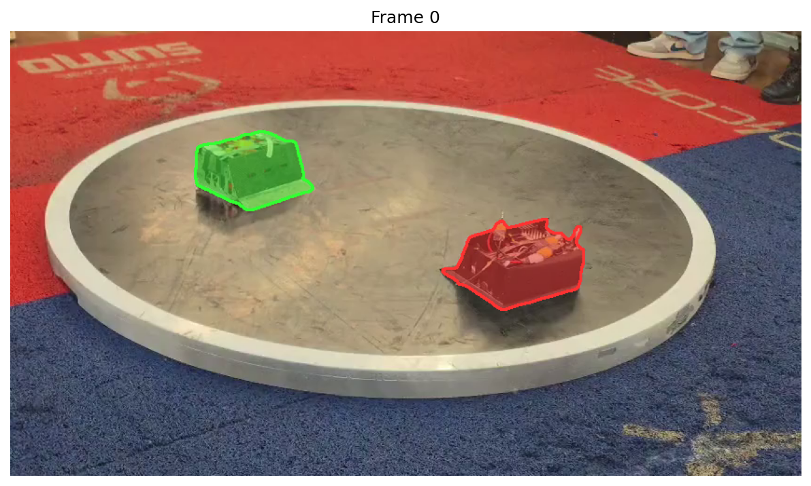
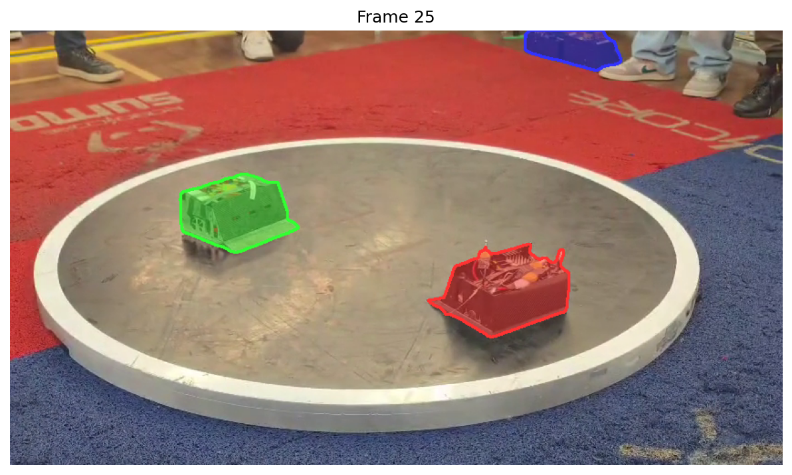
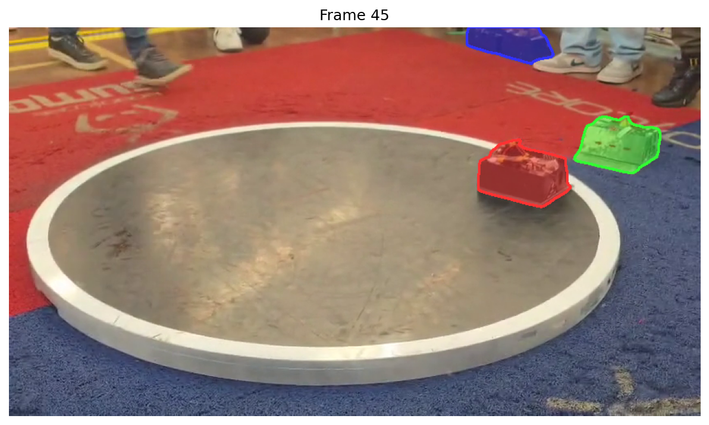

# Resultados e Limitações

## O que funcionou

### Detecção por texto

SAM 3 consegue detectar robôs de sumô usando o prompt `"object on metal platform"`. Não reconhece como "robot", mas entende a descrição visual. A segmentação é precisa, cobrindo bem o corpo dos robôs.

### Tracking temporal

O video predictor mantém identidade dos robôs entre frames. Robô A continua sendo Robô A do início ao fim, sem troca de ID. Isso é essencial pra análise de partida.

### Pipeline funcional

A pipeline completa funciona na RTX 4070 8GB:

1. Converter vídeo pra 10fps com ffmpeg
2. Carregar SAM 3 video predictor
3. Prompt por texto no frame 0
4. Propagar pelo vídeo inteiro
5. Gerar vídeo anotado com máscaras e contornos

## O que não funcionou

### FPS

10fps é o máximo na RTX 4070 8GB. Pra análise detalhada de colisões rápidas, pode não ser suficiente. Robôs de sumô se movem rápido (o round inteiro dura ~3 segundos em média).

### Falsos positivos

Com o vídeo sem crop, o modelo detecta robôs que estão na lateral esperando a vez, fora do dohyo. A detecção está correta (são robôs reais esperando pra lutar), mas pra análise da partida só interessam os dois que estão lutando. A combinação de crop no dohyo + filtro de proximidade resolve isso (ver `05-pipeline-dinamico.md`).

### Prompt genérico

`"object on metal platform"` funciona nesse vídeo, mas pode não generalizar pra todos. Precisa testar com mais vídeos.

### Resolução

A 480x270, o modelo funciona mas a qualidade visual é baixa. A 848x478 com 10fps, estoura a VRAM.

## Limitações do hardware

| O que | Valor |
|-------|-------|
| VRAM total | 7.63 GB |
| Modelo SAM 3 | ~3.6 GB |
| Livre pra frames | ~4 GB |
| Max frames (480p) | ~100 |
| Max frames (848p) | ~50 |
| Feature map por frame | ~40 MB (fixo, independente de resolução) |

## Próximos passos

1. **Rodar pipeline dinâmico:** testar o `annotate_video.py` com ROI dinâmico + filtro de proximidade e validar se elimina falsos positivos.
2. **Testar em GPU maior:** Colab (T4 16GB grátis) ou A100 (40/80GB). Com 16GB, dá pra rodar 30fps+ na resolução original.
3. **Mais vídeos:** testar em outros rounds pra validar o prompt e a robustez do tracking.
4. **Comparar com YOLO:** o experimento com SAM 3 é pra anotação semi-automática. Pra inferência em tempo real, o pipeline final vai usar YOLO + tracker (ByteTrack/BoT-SORT).
5. **Avaliar SAM 3 como ferramenta de anotação:** se o tracking segura bem em mais vídeos, SAM 3 pode gerar pseudo-labels pro treino do YOLO, reduzindo anotação manual.

## Scripts produzidos

| Script | Função |
|--------|--------|
| `experiments/sam3-poc/test_prompts.py` | Testa prompts de texto no image model |
| `experiments/sam3-poc/annotate_image.py` | Anotação frame a frame (sem tracking) |
| `experiments/sam3-poc/annotate_video.py` | Anotação com video predictor (com tracking e ROI) |
| `experiments/sam3-poc/annotate_video_original.py` | Versão original do video predictor (sem ROI) |
