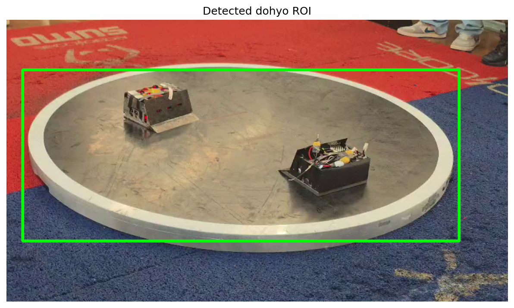
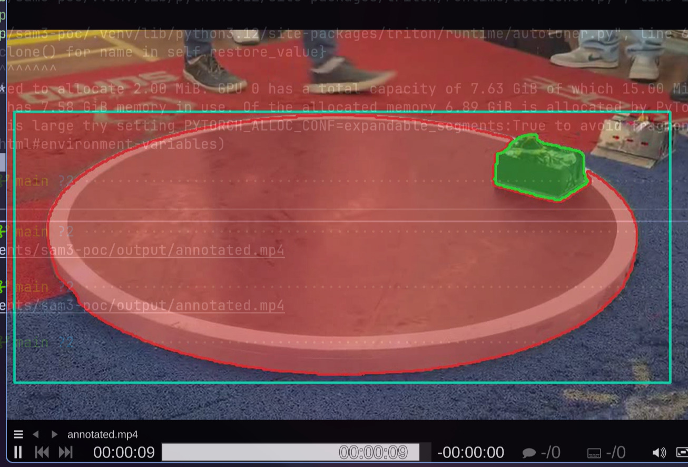
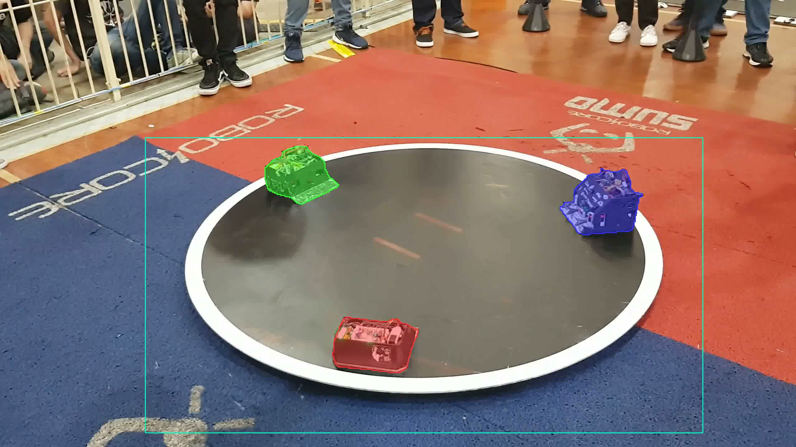
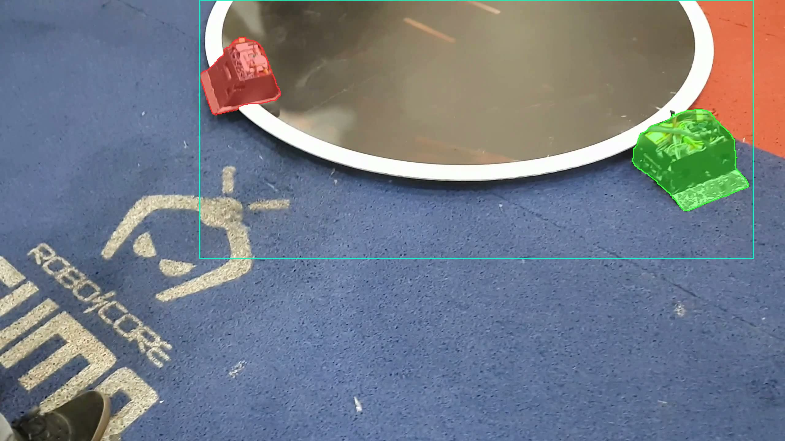
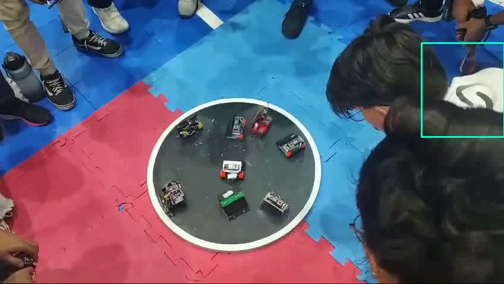
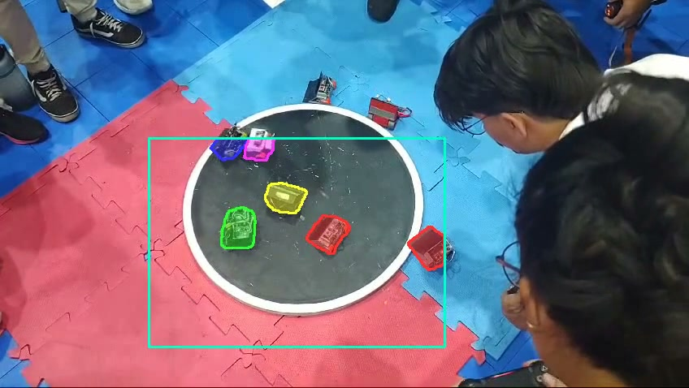

# Pipeline Dinâmico

## O problema com ROI fixo

Na primeira tentativa com crop no dohyo, o ROI era detectado uma vez no frame 0 e aplicado em todos os frames. Isso tem dois problemas:

1. Se a câmera mexer (e sempre mexe, os vídeos são filmados na mão), o dohyo sai da caixa.
2. Se o frame 0 tiver uma detecção ruim (obstrução, ângulo estranho), todo o vídeo fica comprometido.

## ROI dinâmico por frame

A solução: detectar o dohyo em cada frame independentemente.

A detecção usa a tawara (borda branca do dohyo) como referência visual. O processo:

1. Converter frame pra grayscale
2. Threshold binário em 200 (pixels brancos da tawara)
3. Morfologia (close + open) pra limpar ruído
4. Maior contorno externo = dohyo
5. Bounding box + padding de 40px

Se um frame não tiver detecção (ex: robô cobrindo a tawara), usa o último ROI válido como fallback.

```python
def detect_dohyo(frame_bgr):
    gray = cv2.cvtColor(frame_bgr, cv2.COLOR_BGR2GRAY)
    _, white_mask = cv2.threshold(gray, 200, 255, cv2.THRESH_BINARY)
    # morfologia pra limpar
    kernel = cv2.getStructuringElement(cv2.MORPH_ELLIPSE, (5, 5))
    white_mask = cv2.morphologyEx(white_mask, cv2.MORPH_CLOSE, kernel, iterations=3)
    white_mask = cv2.morphologyEx(white_mask, cv2.MORPH_OPEN, kernel, iterations=2)
    # maior contorno = dohyo
    contours, _ = cv2.findContours(white_mask, cv2.RETR_EXTERNAL, ...)
    largest = max(contours, key=cv2.contourArea)
    x, y, w, h = cv2.boundingRect(largest)
    # padding de 40px ao redor
    return x - pad, y - pad, w + 2*pad, h + 2*pad
```



## Filtragem de detecções

Dois problemas aparecem no pós-processamento:

1. O SAM 3 pode detectar mais do que 2 objetos (robôs esperando na lateral, fora do dohyo).
2. O prompt "object on metal platform" faz o modelo detectar o próprio dohyo como objeto. A máscara cobre a plataforma inteira.



A solução: dois filtros em sequência.

### Filtro de área

O dohyo ocupa 60-70% da área do ROI. Um robô ocupa no máximo 3-5%. Qualquer máscara que cubra mais de 15% da área do ROI é descartada.

```python
roi_area = rw * rh
max_mask_ratio = 0.15
for mask in full_masks:
    if np.count_nonzero(mask) > roi_area * max_mask_ratio:
        continue  # dohyo ou outro objeto grande demais
```

### Filtro de proximidade ao centro

Das máscaras que sobreviveram ao filtro de área, calcula o centróide de cada uma e mantém só as 2 mais próximas do centro do ROI. Robôs na lateral ficam mais distantes do centro do dohyo do que os que estão lutando.

```python
center_x, center_y = rx + rw/2, ry + rh/2
for mask in valid_masks:
    ys, xs = np.where(mask > 0)
    dist = sqrt((xs.mean() - center_x)**2 + (ys.mean() - center_y)**2)
# ordena por distância, retorna as 2 mais próximas
```

Os dois filtros juntos rodam em microsegundos. Custo zero no pipeline.

## Mapeamento de volta pro full-frame

O SAM 3 roda no vídeo cropado (480x270), mas o output precisa estar no vídeo original (848x478). Cada máscara passa por:

1. Resize de 480x270 pro tamanho real do crop naquele frame (rw x rh)
2. Posicionamento na coordenada (rx, ry) do frame original
3. Criação de máscara full-frame com zeros e preenchimento na posição correta

Isso permite gerar o vídeo final na resolução original, com as máscaras alinhadas corretamente mesmo com câmera em movimento.

## Pipeline completo

O fluxo final do `annotate_video.py`:

```
Vídeo original (848x478, 60fps)
    │
    ▼
Preprocessamento dinâmico
    ├─ Extrai frames a 10fps (100 frames)
    ├─ Detecta dohyo em CADA frame via threshold
    ├─ Crop + resize pra 480x270
    └─ Salva vídeo cropado
    │
    ▼
SAM 3 Video Predictor
    ├─ Prompt: "object on metal platform" no frame 0
    └─ Propagação temporal por todo o vídeo
    │
    ▼
Pós-processamento por frame
    ├─ Mapeia máscaras de volta pro full-frame
    ├─ Filtra: mantém só os 2 mais próximos do centro do ROI
    └─ Overlay: máscaras coloridas + contorno + retângulo do ROI
    │
    ▼
Vídeo anotado (848x478, 10fps)
```

## Testes em outros vídeos

Pra ver até onde esse v0 do pipeline ia, testamos em cenários fora do escopo (sumô 3kg autônomo 1v1).

### Iron Cup: rumble 3kg (3 robôs)

Vídeo de rumble (3 robôs ao mesmo tempo) da Iron Cup. Resultado: detecção e tracking funcionaram bem no geral. Os 3 robôs foram detectados e mantiveram identidade entre frames.





No momento de impacto entre robôs, o tracking se confundiu brevemente (trocou IDs). As máscaras se sobrepõem e o modelo perde a separação entre objetos.


colisões causam oclusão e deformação das máscaras.

Rumble não está no escopo da pesquisa (foco é 1v1), mas mostra que o pipeline escala pra mais de 2 objetos.

### Minisumo

Vídeo de partida de minisumo. Resultado ruim por dois motivos:

1. **Detecção do dohyo falhou.** O threshold branco pegou o Zeferino ao invés do dohyo em alguns frames. O bounding box ficou torto e instável. A detecção assume que o maior contorno branco é o dohyo, o que não funciona quando a arena tem outros elementos brancos grandes.
2. **Prompt "object on metal platform" não funcionou.** Precisou trocar pra "toy" pra detectar os robôs.





Minisumo não está no escopo. O pipeline foi projetado pra sumô 3kg.

### Conclusão dos testes

O pipeline funciona bem pra sumô 3kg com dohyo padrão. Fora desse cenário, tanto a detecção do dohyo quanto o prompt de texto precisam de ajustes. Isso reforça que o escopo da pesquisa (3kg autônomo) é o certo pra essa primeira versão.

